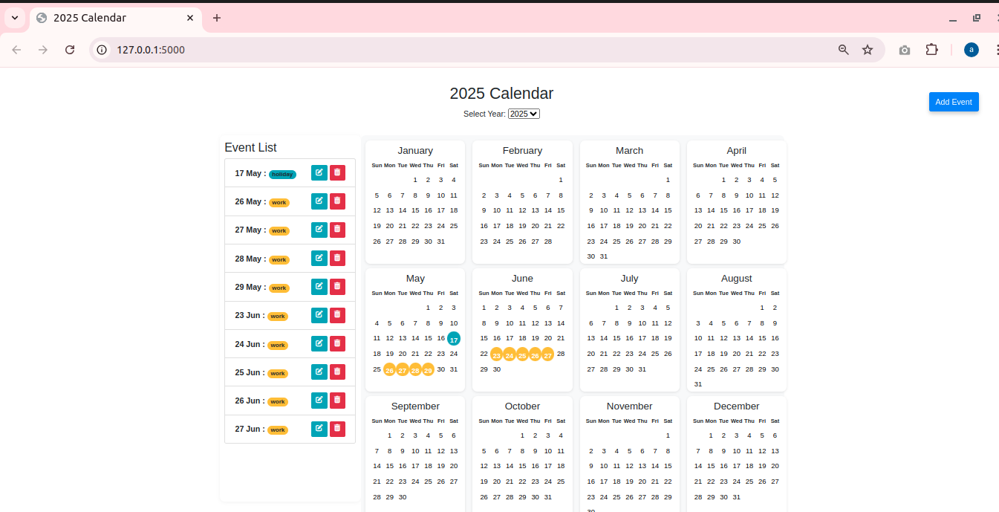

  <h1 style="color: #2c3e50;">📅 Event Calendar Web App</h1>
  
A responsive and interactive <strong>Event Calendar Web Application</strong> built with <strong>Flask</strong>, <strong>SQLite</strong>, <strong>Bootstrap</strong>, and <strong>JavaScript</strong>. This app allows users to <em>view, add, edit, and delete events on specific calendar dates</em>, grouped by categories with customizable colors.

  

    
    
Screenshot of the Event Calendar Web Application

  

  

  <h2 style="color: #34495e;">✨ Features</h2>
  <ul>
    <li>📅 <strong>Dynamic Yearly Calendar</strong> — users can select the year to view the calendar.</li>
    <li>➕ <strong>Add Events</strong> — assign titles, select multiple dates, and categorize events.</li>
    <li>📝 <strong>Edit Events</strong> — update event title, category, and dates through a modal interface.</li>
    <li>❌ <strong>Delete Events</strong> — remove events directly from the event list.</li>
    <li>🎨 <strong>Category Color Coding</strong> — categories are color-coded for easy visual distinction.</li>
    <li>📑 <strong>Event List Sidebar</strong> — displays a sorted list of all added events with category badges.</li>
    <li>📊 <strong>SQLite Database</strong> — lightweight backend for storing event details.</li>
  </ul>

  <h2 style="color: #34495e;">🛠️ Tech Stack</h2>
  <ul>
    <li><strong>Backend:</strong> Python, Flask, SQLite</li>
    <li><strong>Frontend:</strong> HTML, Bootstrap 4, JavaScript, jQuery</li>
    <li><strong>Libraries:</strong> Font Awesome (for icons), Bootstrap Modal</li>
  </ul>

  <h2 style="color: #34495e;">📌 Key Improvements</h2>
  <ul>
    <li>Shifted from using index-based event identifiers to <strong>database event IDs</strong> for reliable event management.</li>
    <li>Enhanced <strong>edit modal logic</strong> to dynamically load event data based on event IDs.</li>
    <li>Clean and organized code structure for templates, routes, and static assets.</li>
  </ul>

  <h2 style="color: #34495e;">🚀 How to Run</h2>
  <ol>
    <li>Clone the repository.</li>
    <li>Install dependencies:
      <pre style="background: #ecf0f1; padding: 10px; border-radius: 4px;">pip install -r requirements.txt</pre>
    </li>
    <li>Run the application:
      <pre style="background: #ecf0f1; padding: 10px; border-radius: 4px;">python app.py</pre>
    </li>
    <li>Open your browser at <a href="http://localhost:5000/" target="_blank">http://localhost:5000/</a></li>
  </ol>

